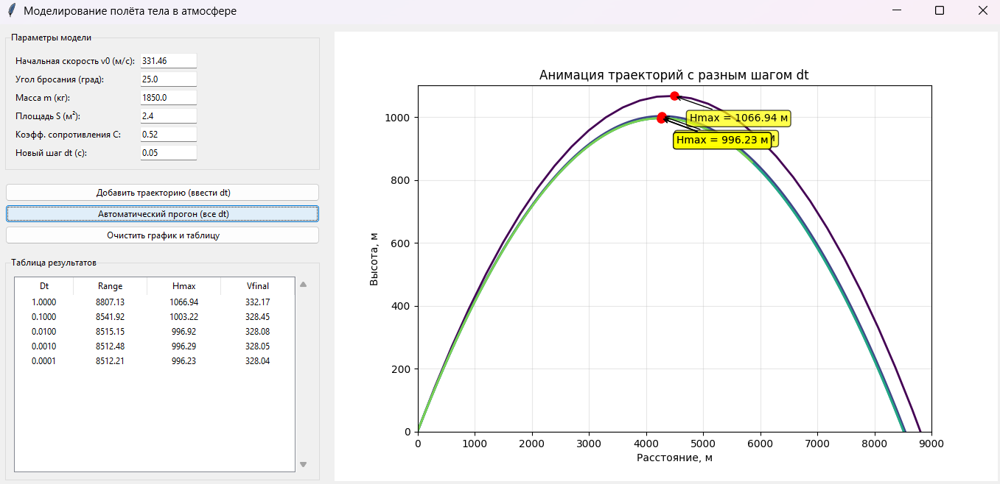

# Моделирование полёта тела в атмосфе
* Задание:

Реализовать приложение для моделирования полёта тела в атмосфере.
Предусмотреть возможность ввода шага моделирования и вывода результатов.

* Для выполнения лабораторной было потрачено 3 человекочаса с учётом попыток самостоятельной реализации GUI.

* Применение готовых формул в правильном порядке почти не составило проблем, спустя минут 20 с начала выполнения всё интуитивно стало понятно.
* Сначала я реализовал модель которая работает в "тепличных" условиях, в вакууме, т.е. не учитывает сопротивление, ускорение и плотность. Далее модель была модифицирована, путём добавления необходимых переменных.
* Изначально интерфейс был написан от руки через matplotlib.pyplot, но не понравилось и с помощью DeepSeek реализован tkinter с анимированной графикой.
* В лабораторной параметры по умолчанию указаны приблизительно такие, чтобы соответствовать Lada Niva 4х4 вылетевшей со скоростью звука, также в ходе тестов были запущены теннисный шарик, баскетбольный мяч и много чего еще, было интересно покликать в симуляторе.