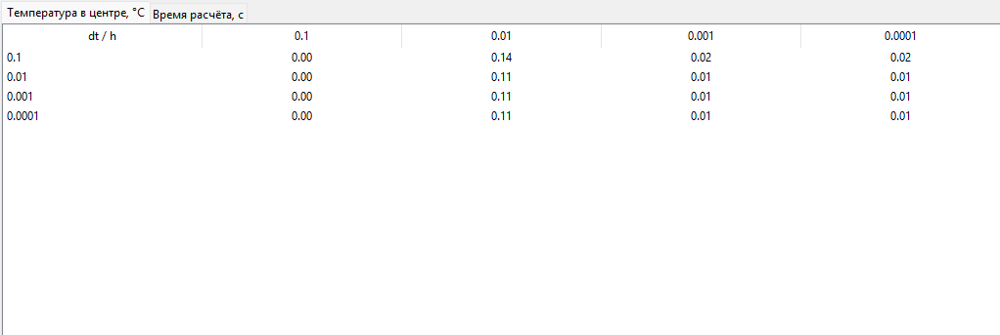
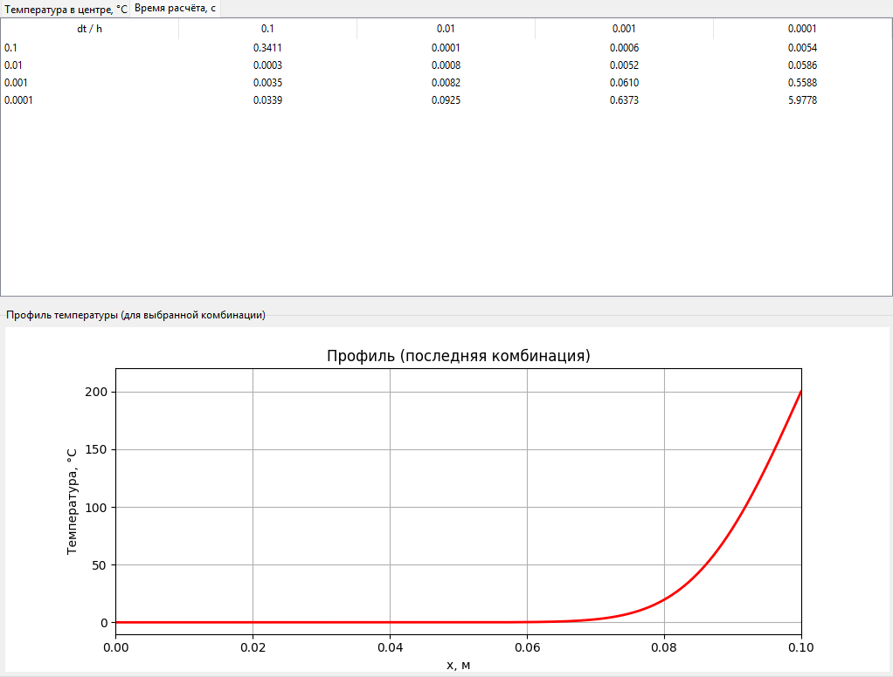

# Метод конечных разностей для уравнения теплопроводности
* Задание:
Реализовать моделирование изменения температуры в пластине на основе одномерного уравнения теплопроводности с использованием метода конечных разностей.
Выполнить моделирование с различными шагами по времени и по пространству.
Заполнить таблицу значений температуры в центральной точке пластины после 2 секунд модельного времени.

* Для выполнения практической части лабораторной был потрачен 1 человекочас, если включать изучение теории, то всего вышло 3 человекочаса.

* В отличии от прошлой лабораторной, применить готовые формулы я сразу не смог, потому что долго не мог вникнуть в происходящее.
* Фатальной ошибкой стало не прочитав методичку полезть за объяснениями к нейронной сети.
* После того, как я уже почти реализовал явную схему метода сеток, я понял, что я зашёл не в те ворота и пошёл читать методичку.
* На понимание работы алгоритма ушло достаточно много времени, скорее от недосыпа, чем от неспособности.
* Это все не стало проблемой, метод сходится, интерфейс реализован, все работает корректно с точки зрения моделирования.